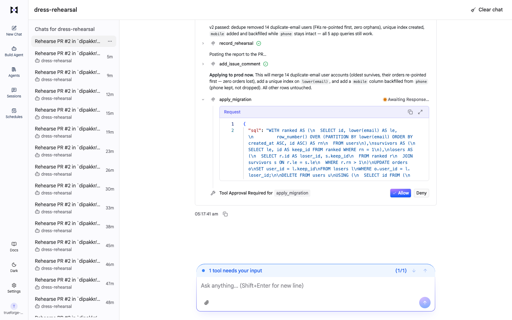

# Migration Rehearsal

An agent that tests your database migration on a masked copy of real production data before it's allowed near production, fixes what breaks, and waits for a human before the one step you can't undo.

Built on [TrueForge](https://github.com/truefoundry/trueforge) for the TrueFoundry × Polaris "Agents That Act" hackathon.

> CI passed on an empty database. Prod disagreed.

A two-line migration adds a unique index on `lower(email)` and renames `phone` to `mobile`. CI is green and review says LGTM. On prod it fails, because 14 customers signed up twice with different capitalization, and two app queries still read `phone`. Existing migration tools (Atlas, Squawk, Bytebase, PlanetScale) check the SQL text. None of them run it against your real data. Migration Rehearsal does.



▶ [Watch a full run at 4× speed (68 s)](docs/demo/demo-4x.mp4): PR read → rehearsal fails → fix → rehearsal passes → approval → server-verified commit.

## What the agent does

1. Reads the PR and the migration through the GitHub MCP server, and prod's schema through **pgwarden** (our MCP server, the only thing that holds the prod credential).
2. Writes a rehearsal script and runs it in a TrueForge **Daytona sandbox**: it copies the affected tables (masked, full, no credentials), boots a throwaway Postgres, applies the migration, and replays the app's queries.
3. Finds the failure, writes a fixed migration, and rehearses again until it passes.
4. Posts the report on the PR, says in plain English what it's about to do, and calls `apply_migration`, which **pauses for a human**.
5. On Allow, pgwarden re-runs the SQL in a transaction and commits only if the real effects equal what the human approved.

| Autonomous | Needs a human | Never, even with approval |
|---|---|---|
| Reads, sandbox work, rehearsal record, PR comment | `apply_migration` | DROP TABLE, TRUNCATE, DROP/RENAME COLUMN, GRANT/REVOKE, DELETE without WHERE, merge/push |

Details and threat model: [SAFETY.md](SAFETY.md).


## Quickstart

**You need:** Node 22.14+, the GitHub CLI (`gh`, logged in), a Postgres 16 to play "prod" (local Docker or [Neon](https://neon.tech) free tier), a [Daytona](https://daytona.io) API key with **`write:sandboxes`, `write:snapshots` and `delete:snapshots`**, and one model key: TrueFoundry AI Gateway, OpenAI, or Anthropic.

```bash
git clone https://github.com/<you>/truefoundry-hackathon && cd truefoundry-hackathon
cp .env.example .env          # fill in DATABASE_URL, keys, SHOPKART_REPO=<you>/shopkart
npm install
# no Postgres handy? docker run -d --name dr-pg -e POSTGRES_PASSWORD=dev -e POSTGRES_DB=shopkart -p 55432:5432 postgres:16
npm run seed                  # loads the demo "prod" data (5,014 users, 20,000 orders)
npm run demo-pr               # creates <you>/shopkart and opens the demo PRs (#1, #2)

# terminal 1
npm run trueforge                     # TrueForge on http://localhost:8790 (allows it to reach pgwarden on localhost)
# terminal 2
npm run pgwarden                      # pgwarden MCP on http://localhost:8787/mcp
# terminal 3
npm run setup                 # registers model, sandbox, MCP servers, skill and agents in TrueForge
npm run doctor                # checks everything and tells you what's missing
```

Open http://localhost:8790, pick the **migration-rehearsal** agent and send:

> Rehearse PR #1 in `<you>/shopkart` against prod before we merge. If it's safe, apply it.

Run `npm run reset` between runs to restore the demo data.

## Tested

- **Fresh clone, README only** (26 Sep 2026, macOS, Node 25): `git clone` → `.env` → `npm install` → `seed` → `trueforge` + `pgwarden` → `setup` (all green) → `doctor` (nothing to fix) → full rehearsal ending in a server-verified commit in 190 s.
- **Automated runs** (`npm run e2e`, real agent, real sandbox, real approval events): see [docs/demo/reliability.md](docs/demo/reliability.md).
- **pgwarden:** 43 tests (golden effects, masking properties, schema round-trip, every refusal code).

## How it's built

| Part | What it is |
|---|---|
| `pgwarden/` | TypeScript MCP server (Streamable HTTP, bearer auth). Six tools; `apply_migration` is the only one that changes prod and is gated. Masking, effects engine, statement policy. |
| `skills/migration-rehearsal/` | Git-backed TrueForge skill: the procedure the agent follows, plus two plumbing helpers for the sandbox (`pg_boot.py`, `effects.py`). The agent writes the rehearsal code itself each run. |
| `agent/` | TrueForge agent specs: `migration-rehearsal` and a `naive` variant with no safety instructions (used to show the server holds on its own). |
| `seed/` | Deterministic demo data with the planted problems. |
| `scripts/` | `setup`, `doctor`, `reset`, `demo-pr`, `e2e` (automated runs through the TrueForge SDK). |
| `fixtures/effects-golden.json` | The effects format both the sandbox and the server must produce. |

## Troubleshooting

- **Daytona setup fails:** the API key needs Snapshots write permission. The first setup builds a snapshot and takes a few minutes.
- **GitHub:** TrueForge's GitHub connector uses a token. `setup` takes `GITHUB_TOKEN` from `.env`, or falls back to `gh auth token`. For anything beyond a demo, use a fine-grained PAT limited to the shopkart repo.
- **`Outbound URL blocked for host "localhost"`:** start TrueForge with `npm run trueforge`, which sets `OUTBOUND_URL_ALLOWED_HOSTS`.
- **Agent can't reach pgwarden:** `npm run pgwarden` must be running; `npm run doctor` checks it.
- **Numbers don't match after a run:** `npm run reset`.

## AI assistance

This project was built with Claude Code (Anthropic). The team designed the idea, architecture, safety model and contracts; Claude Code helped write the plan, the code and the docs under that direction. We can explain every part of the architecture.
