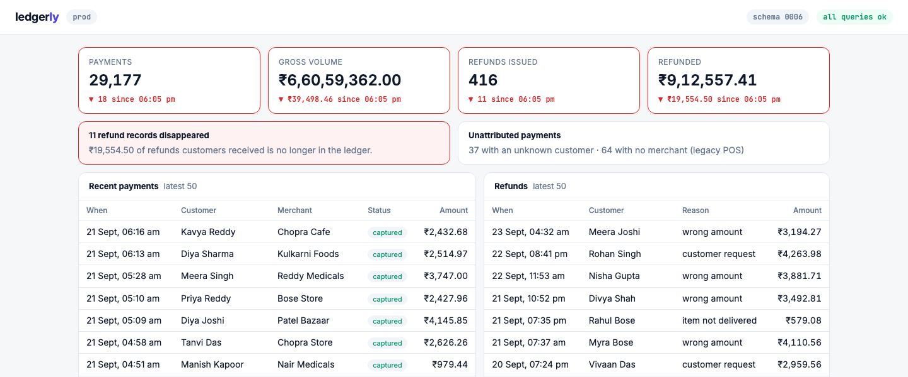
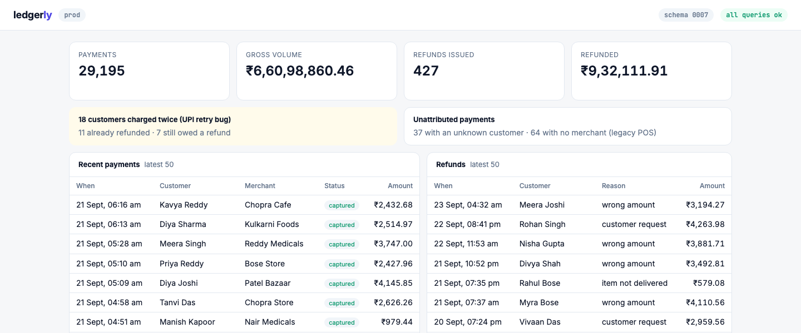

# Migration Rehearsal: Technical Documentation

**Repo:** github.com/dipakkr/truefoundry-hackathon 
· **Demo app:** github.com/dipakkr/ledgerly

## The problem
Every team tests database migrations in CI or on a **UAT database**, but those don't have production's years of messy history, and migrations break on **real data**. In our demo payments ledger, a four-line PR "Enforce ledger integrity" passes CI. Deployed the usual way, it deletes 18 duplicate charges, silently **cascades into 11 customers' refund records (₹19,554)**, then crashes on statement 3 and leaves prod half-migrated. The bug is in the data, not the code, and it can't be undone.

## What the agent reaches
Every PR runs a GitHub workflow that starts a TrueForge session. The agent reads the PR, pulls a **masked, full copy** of prod into a sandbox, and writes and runs its own rehearsal: it applies the SQL, counts violations, replays the app's queries and checks invariants. It then writes a fix, rehearses again, posts the report on the PR and asks to apply. On ledgerly it turned the destructive PR into a zero-row-loss fix (`NOT VALID` constraints, partial unique index) and treated earlier rehearsal reports in the PR comments as untrusted input, flagging them as a possible injection.

## Ledgerly: three states of prod
1 · Before: healthy (schema 0006) 

 
 
  

 2 · Deployed the usual way: broken 

   
 
  3 · Through Migration Rehearsal: safe (0007) 

 

 427 refunds, 18 double charges, 37 + 64 legacy rows | 11 refunds (₹19,554.50) and 18 payments gone; half-migrated at 0006 | New rules live, every payment and refund intact |

## Where it stops
Applying to prod. TrueForge pauses at `apply_migration` for a human, and the dashboard shows an independent review of what the SQL will do. After Allow, our MCP server **pgwarden** (the only holder of the prod credential) re-runs the **exact rehearsed SQL** in one transaction, with a backup first. It commits only if the real effects equal the approved ones. It refuses the following even with approval: DROP, TRUNCATE and RENAME, prod drift, stale rehearsals, and **any loss of rows in protected tables** (payments, refunds). The PR can't merge until the check is green.

## Architecture

GitHub PR → Actions (self-hosted runner) → **TrueForge**: agent, Daytona sandbox, GitHub MCP, pgwarden MCP → approval → pgwarden apply → Postgres → PR check. Onboarding (`npm run onboard`) connects any repo: DB check, PII scan, a per-project pgwarden and agent, a workflow PR, and branch protection.

## How TrueForge was used
TrueForge provides:
- the **agent runtime** (Claude Sonnet 5, 60-step budget);
- the **Code Mode sandbox** on Daytona, holding **zero credentials**, proven every run;
- **MCP connections** with vaulted tokens and a `call_tool` bridge from the sandbox;
- the **human approval gate**, with durable pause and resume;
- a **git-pinned skill**;
- the **sessions API**, which drives CI statuses and our trace dashboard.

We wrote no agent loop.

## Real vs mocked
**Real:** TrueForge, the model, Daytona, GitHub PRs, Actions, statuses and branch protection, Postgres, masking and every apply. **Simulated:** "prod" is a local Postgres with generated, deterministic data. There are no real customers.

## In action
A real CI-triggered run on ledgerly. Left: TrueForge's steps (sandbox proof, masked export, v1 fails, v2 fix). Right: the approval with the independent review ("recommend: allow", 0 rows change).

TrueForge's own approval card, pausing the run until a human decides:

## Edge cases covered
| Caught in rehearsal (shown on ledgerly) | Refused by pgwarden, even with human approval |
|---|---|
| Passes CI/UAT, fails on real data (FK, NOT NULL on legacy rows) | Effects on the card differ from reality: `EFFECTS_MISMATCH`, rolled back |
| Silent cascade deletes (payments → refunds) | SQL changed after rehearsal, even one character: `REHEARSAL_MISMATCH` |
| Half-applied deploys (applies are one transaction instead) | No rehearsal, or a failed one: `REHEARSAL_NOT_FOUND` / `_FAILED` |
| Legacy data grandfathered, not deleted (`NOT VALID`, partial index) | DROP / TRUNCATE / RENAME: `POLICY_REFUSED` |
| The agent's own destructive fix (−119 payments) exposed on the card | Rows lost in protected tables: `PROTECTED_ROWS_LOST` |
| Prompt injection in PR text and comments, treated as untrusted | Prod changed since rehearsal: `DRIFT_DETECTED`; approval after 30 min: `REHEARSAL_STALE` |
| PII leaving prod (5 columns masked); 0 credentials in the sandbox | Two applies at once: `APPLY_IN_PROGRESS`; backup before every apply |

## Known limits
- The agent's fixes vary between runs. Before protected tables existed, two destructive fixes were approved in testing.
- Effects count rows and schema, not changed values.
- Full-table copies suit demo scale only.
- One runner per repo, so jobs queue.
- An applied fix isn't yet written back to the PR's migration file.
